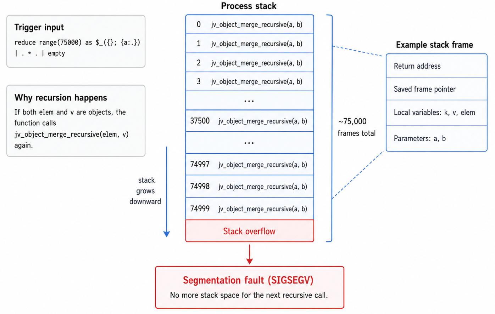

# How I Found the `jq` Object Merge Stack Overflow

A month back I needed to build a tiny [Sigma](https://sigmahq.io/) processor, and it was a fun little project. That got me back into the mood to poke at something else, and `jq` felt like a perfect target.

I like the tool, it is written in C, and around that time it had fixed a bunch of vulnerabilities in a pretty short span. That usually gets my attention. Sometimes it just means more people are looking. Sometimes it means there is a whole bug class waiting to be pulled apart.

This post is about one of the bugs I found:
- `CVE-2026-43896`

I found more than one issue while looking at `jq`, but some of the other ones are still waiting on disclosure, so I am keeping this to the object merge bug since that one is already public.

## Why I looked at object merge

Pretty quickly I noticed a pattern in `jq`:

- it is very easy to build deeply nested values
- several helpers recurse over those values
- not every recursive path seemed to have a depth guard

That made me stop thinking in terms of one bug and start thinking in terms of a bug class.

Once I was in that mindset, `jv_object_merge_recursive()` stood out.

What made it interesting was not just that it was recursive. A lot of code is recursive. What mattered was that it sat behind the `*` operator when both sides are objects:

```c
} else if (ak == JV_KIND_OBJECT && bk == JV_KIND_OBJECT) {
  return jv_object_merge_recursive(a, b);
}
```

So the question became simple:

> what happens if I hand `jq` two absurdly deep objects with the same shape and ask it to merge them?

## Building the PoC

The nice thing about `jq` is that I did not need an input file to test this. I could build the bad structure directly inside the language.

This was the building block:

```jq
reduce range(75000) as $_ ({}; {a:.})
```

That starts with `{}` and keeps wrapping it:

```text
{}
{a:{}}
{a:{a:{}}}
{a:{a:{a:{}}}}
...
```


Once I had that, the full PoC was just:

```jq
reduce range(75000) as $_ ({}; {a:.}) | . * . | empty
```

In other words:

1. build one very deep object
2. merge it with itself
3. throw the result away

The real trigger is `. * .`. `empty` is just there to keep the filter tidy.

## Reproducing the crash

I always like trying the normal build first:

```bash
jq -n -f poc.jq
```

That crashed with a plain:

```text
Segmentation fault
```

That already told me this was real and not just some sanitizer complaint.

Then I reran it against a sanitizer build, which made the failure much clearer:

- ASan reported `stack-overflow`
- the trace repeated `jv_object_merge_recursive()` over and over

That was the confirmation I wanted. This was not heap corruption or parser weirdness. It was exactly what it looked like: unbounded recursion burning through the call stack.

## Reading the function

After that, the source was easy to read because I already knew what I was looking for.

The important part lives in `src/jv.c`:

```c
jv jv_object_merge_recursive(jv a, jv b) {
  jv_object_foreach(b, k, v) {
    jv elem = jv_object_get(jv_copy(a), jv_copy(k));
    if (jv_is_valid(elem) &&
        JVP_HAS_KIND(elem, JV_KIND_OBJECT) &&
        JVP_HAS_KIND(v, JV_KIND_OBJECT)) {
      a = jv_object_set(a, k, jv_object_merge_recursive(elem, v));
    } else {
      jv_free(elem);
      a = jv_object_set(a, k, v);
    }
    if (!jv_is_valid(a)) break;
  }
  jv_free(b);
  return a;
}
```

The bug is not subtle.

If both objects have the same nested shape, the function just keeps calling itself on the next inner `{a: ...}` pair. There is no depth limit. No recursion guard. It just keeps going until the stack runs out.

## Why I liked this bug

I liked this one because it was clean:

- short PoC
- reliable crash
- easy path to the vulnerable function
- easy root cause to explain

Those are the nicest bugs to report. You do not have to spend half the writeup trying to convince anyone that the bug is real.

## What it turned into

This one ended up disclosed as:

- [GHSA-mg96-6h3q-g846](https://github.com/jqlang/jq/security/advisories/GHSA-mg96-6h3q-g846)
- `CVE-2026-43896`

GitHub scored it:

```text
CVSS:3.1/AV:L/AC:L/PR:N/UI:N/S:U/C:N/I:N/A:H
```

and marked it `Moderate`, which feels fair. It is a real crash, but it is still a stack exhaustion bug, not some dramatic RCE story.

## The useful takeaway

The part I think is worth keeping is this:

Once you find one recursion bug in a codebase, do not stop at the first crash. Follow the class.

Look at:

- comparison
- equality
- merge
- tree walking
- recursive transforms

If the code works on nested data, there is a decent chance the same mistake shows up in more than one place.

That was definitely true here.

## Short version

The whole story is basically:

1. I started looking at `jq` because it seemed like a good C target and it had recent security fixes.
2. I noticed recursive logic around nested values.
3. I followed the object merge path behind `*`.
4. I built a deeply nested object directly in `jq`.
5. I merged it with itself.
6. `jq` crashed.
7. ASan confirmed stack overflow.
8. Reading `jv_object_merge_recursive()` made the root cause obvious.

Sometimes that is all bug hunting really is. Spot a pattern, push it a bit further than the code expects, and see where it breaks.
